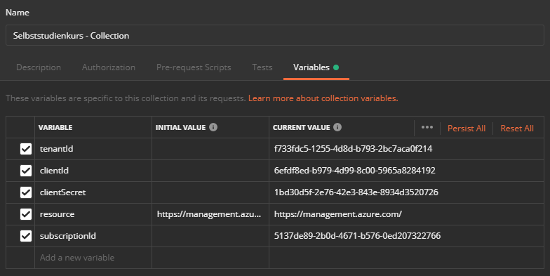
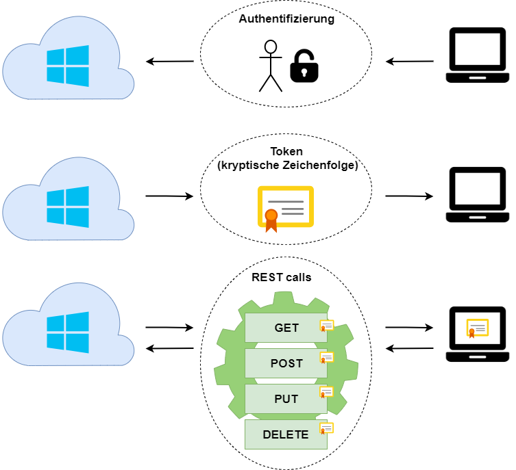

# Azure Login

In diesem Kapitel werden die Grundlagen zum automatisierten Azure Login erleutert und erklärt. Anhand praktischen Beispielen werden Sie die Grundanforderungen erlernen um ein REST API im Kapitel 02-VM erstellen zu können.

### **Lernziele**
Wenn Sie dieses Kapitel durchgearbeitet haben, kennen Sie die wichtigsten Parameter der Azure Plattform welche für die Automatisierung wichtig sind und können diese in einem REST API Client einbinden und Sie lernen die Authetifizuerung mittels dem Bearer Token kennen.

### **Inhaltsverzeichnis**
- [Azure ID's auslesen](#Azure-Plattform)
- [REST API Client](#REST-API-Client)
- [Bearer Token](#Bearer-Token)

# Azure ID's auslesen
>[&uarr; **_Zum Inhaltsverzeichnis_**](#Inhaltsverzeichnis)

Für was benötigen Sie solche ID's?<br>

ID's werden benötigt, um dem erstelltem HTTP Request sein eindeutiges Ziel anzugeben. Solch ein Request kann zum Beispiel wie folgt aussehen:<br>

```
GET https://management.azure.com/subscriptions/5137de89-2b0d-4671-b576-0ed207322766/resourcegroups?api-version=2017-05-10
```

In diesem Beispiel können Sie beispielsweise die Ressourcegruppen einer SubscriptionID herauslesen.<br>

---

Folgende ID's benötigen Sie von Azure um weiterzufahren:

- tenantId
- subscriptionId
- clientId
- clientSecret
- resource &rarr; `https://management.azure.com/`

### **Azure Cloud Shell**
Gehen Sie auf Ihr Microsoft Azure Konto und öffnen Sie Cloud Shell.<br>

Geben Sie folgende Befehle ein:<br>
```
az account set --subscription "Ihr Subscription Name"
```

```
PS Azure:\> az account show
{
  "environmentName": "AzureCloud",
  "id": "5137de89-2b0d-4671-b576-0ed207322766",
  "isDefault": true,
  "name": "Kostenlose Testversion",
  "state": "Enabled",
  "tenantId": "f733fdc5-1255-4d8d-b793-2bc7aca0f214",
  "user": {
    "name": "mario.koller@edu.tbz.ch",
    "type": "user"
  }
}
```

```
PS Azure:\> az ad sp create-for-rbac -n "Selbststudienkurs"
Changing "Selbststudienkurs" to a valid URI of "http://Selbststudienkurs", which is the required format used for service principal names
Creating a role assignment under the scope of "/subscriptions/5137de89-2b0d-4671-b576-0ed207322766"
{
  "appId": "af038b9b-a0f2-49e5-8bf1-8a8fa74d4e69",
  "displayName": "Selbststudienkurs",
  "name": "http://Selbststudienkurs",
  "password": "62f888a1-8275-420d-818e-3aba5966dade",
  "tenant": "f733fdc5-1255-4d8d-b793-2bc7aca0f214"
}
```

Sie haben nun alle ID's welche Sie benötigen.<br>

**tenantId**<br>
*tenantid: f733fdc5-1255-4d8d-b793-2bc7aca0f214*<br>

**subscriptionId**<br>
*id: 5137de89-2b0d-4671-b576-0ed207322766*<br>

**clientId**<br>
*appId: af038b9b-a0f2-49e5-8bf1-8a8fa74d4e69*<br>

**clientSecret**<br>
*appId: 62f888a1-8275-420d-818e-3aba5966dade*<br>

# REST API Client
>[&uarr; **_Zum Inhaltsverzeichnis_**](#Inhaltsverzeichnis)

Um ein REST API absetzen zu können, benötigt man unter Windows ein REST API Client.<br>

Meine bisherigen Erfahrungen habe ich mit Postman gemacht, daher wird dies hier aufgezeigt.<br>
Postman kann direkt ab folgendem [Link](https://app.getpostman.com/run-collection/41b9fa3b957c297f283d#?env%5BAzure%20REST%5D=W3siZW5hYmxlZCI6dHJ1ZSwia2V5IjoidGVuYW50SWQiLCJ2YWx1ZSI6IiIsInR5cGUiOiJ0ZXh0In0seyJlbmFibGVkIjp0cnVlLCJrZXkiOiJjbGllbnRJZCIsInZhbHVlIjoiIiwidHlwZSI6InRleHQifSx7ImVuYWJsZWQiOnRydWUsImtleSI6ImNsaWVudFNlY3JldCIsInZhbHVlIjoiIiwidHlwZSI6InRleHQifSx7ImVuYWJsZWQiOnRydWUsImtleSI6InJlc291cmNlIiwidmFsdWUiOiJodHRwczovL21hbmFnZW1lbnQuYXp1cmUuY29tLyIsInR5cGUiOiJ0ZXh0In0seyJlbmFibGVkIjp0cnVlLCJrZXkiOiJzdWJzY3JpcHRpb25JZCIsInZhbHVlIjoiIiwidHlwZSI6InRleHQifV0=) installiert werden.<br>

Sie können aber gerne einen anderen Client verwenden.

### **Postman konfigurieren**

Wenn Postman installiert ist, muss dieser noch konfiguriert werden, mit den Angaben welche Sie vorhin von Azure ausgelesen haben.

1. Erstellen Sie im linken Teil des GUI eine neue Collection
2. Geben Sie Ihr einen passenden Namen und konfigurieren Sie die Variablen
<br>



# Bearer Token
>[&uarr; **_Zum Inhaltsverzeichnis_**](#Inhaltsverzeichnis)

Die Trägerauthentifizierung (auch als Tokenauthentifizierung bezeichnet) ist ein HTTP-Authentifizierungsschema, welcher Sicherheitstoken umfasst, die als Träger-Token bezeichnet werden. Der Name "Trägerauthentifizierung" kann als "*Zugriff auf den Träger dieses Tokens gewähren*" verstanden werden. Der Trägertoken ist eine kryptische Zeichenfolge, die normalerweise vom Server als Antwort auf eine Anmeldeanforderung generiert wird. Der Client muss diesen Token im Authorization-Header senden, wenn er Anforderungen an geschützte Ressourcen sendet.<br>

Folgende Grafik sollte dies besser veranschaulichen können.<br>

<br>

### **Bearer Token Abfrage**

`GET https://login.microsoftonline.com/{{tenantId}}/oauth2/token?api-version=2019-03-01`<br>
{{tenantId}} ist eine Variable welche Sie in der Collection erfasst haben.<br>

Im Body muss die Option **form-data** mit folgenden Angaben ausgefüllt werden.<br>

Key             | Value
----------------|-----------------------------------------
grant_type      | `client_credentials`
client_id       | `{{clientId}}`
client_secret   | `{{clientSecret}}`
resource        | `https://management.core.windows.net/`

Als Statusausgabe erhalten Sie den HTTP Request 200 OK, mit folgendem Inhalt:<br>

```
{
    "token_type": "Bearer",
    "expires_in": "3600",
    "ext_expires_in": "3600",
    "expires_on": "1573656273",
    "not_before": "1573652373",
    "resource": "https://management.core.windows.net/",
    "access_token": "eyJ0eXAiOiJKV1QiLCJhbGciOiJSUzI1NiIsIng1dCI6IkJCOENlRlZxeWFHckdOdWVoSklpTDRkZmp6dyIsImtpZCI6IkJCOENlRlZxeWFHckdOdWVoSklpTDRkZmp6dyJ9.eyJhdWQiOiJodHRwczovL21hbmFnZW1lbnQuY29yZS53aW5kb3dzLm5ldC8iLCJpc3MiOiJodHRwczovL3N0cy53aW5kb3dzLm5ldC9mNzMzZmRjNS0xMjU1LTRkOGQtYjc5My0yYmM3YWNhMGYyMTQvIiwiaWF0IjoxNTczNjUyMzczLCJuYmYiOjE1NzM2NTIzNzMsImV4cCI6MTU3MzY1NjI3MywiYWlvIjoiNDJWZ1lMakVmUExTaXpkZHladnIvM3UvMWwvN0RBQT0iLCJhcHBpZCI6IjZlZmRmOGVkLWI5NzktNGQ5OS04YzAwLTU5NjVhODI4NDE5MiIsImFwcGlkYWNyIjoiMSIsImlkcCI6Imh0dHBzOi8vc3RzLndpbmRvd3MubmV0L2Y3MzNmZGM1LTEyNTUtNGQ4ZC1iNzkzLTJiYzdhY2EwZjIxNC8iLCJvaWQiOiJhMTNjOWYxNy0wZjkxLTQzZDctODY0MS0wMzM4NGE0N2Q3NzQiLCJzdWIiOiJhMTNjOWYxNy0wZjkxLTQzZDctODY0MS0wMzM4NGE0N2Q3NzQiLCJ0aWQiOiJmNzMzZmRjNS0xMjU1LTRkOGQtYjc5My0yYmM3YWNhMGYyMTQiLCJ1dGkiOiJLYWRIQ1RXSTJVcS1oZ2IxOFk3dUFBIiwidmVyIjoiMS4wIn0.JCV523Ze9LCGztj9R7aqL3baSI1uJq1giSwdYhVTsDLMZmlLseCiHi2WdonpAvozCTiNJMzIpTQi_yn450BpMXP9CTzLwmDKlL5QBQb6DMfOhcEpJoio_tR-cjnS0o2RF9YZfleQhoesXkpuCLYhA48CCsoDLJqp1eLsNRfmad8ktRuzKWNq5zKLqM06yAj85AzKgYKSlNK4oXNMyeMoWRmmxfSMkLmWTMgmFPahVwLYSEdumg4fsZ4Esl6nyvEdCilw85JWuPKtrQypyRiI5tOwulBacG01BRqorMvWQU1R3-_2v9SppPIkrDQ3Ro1j7EcwDf2WJQpnXuthBdLmIQ"
}
```
Diese kryptische Zeichenfolge ist Ihr Bearer Token, welcher nun für **eine Stunde gültig** ist.<br>

### **Bearer Token automatisieren**

Um das ganze besser automatisieren zu können, erstellen Sie folgenden POST Request, welcher den Bearer Token direkt in die Variable {{bearerToken}} abspeichert.<br>

Erstellen Sie folgenden POST Request:<br> 
`POST https://login.microsoftonline.com/{{tenantId}}/oauth2/token`<br>

Im Body muss die Option **x-www-form-urlencoded** gewählt werden und folgende Informationen müssen eingefügt werden.

Key             | Value
----------------|--------------------
grant_type      | `client_credentials`
client_id       | `{{clientId}}`
client_secret   | `{{clientSecret}}`
resource        | `{{resource}}`

Unter Tests fügen Sie dann noch nachfolgenden Code ein.

```
pm.test(pm.info.requestName, () => {
    pm.response.to.not.be.error;
    pm.response.to.not.have.jsonBody('error');
});
pm.globals.set("bearertoken", pm.response.json().access_token);
```

Nun wird beim absetzen des POST Request die Variable {{bearerToken}} automatisiert mit dem passendem Wert gefüllt.

> **WICHTIG: Vergessen Sie nicht diesen POST Request abzuspeichern!**