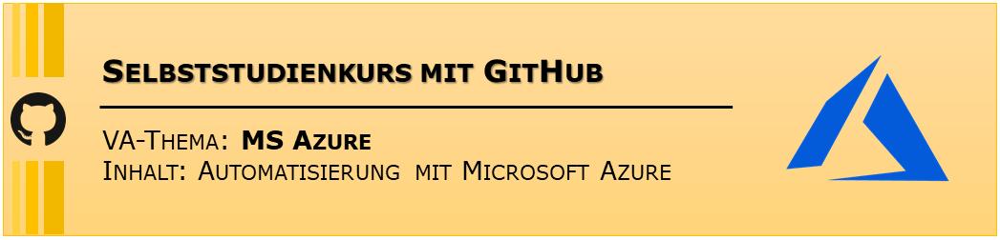

# Automatisierung mit MS Azure

### **Ihr Nutzen**

- Sie lernen die Microsoft Azure Plattform kennen
- Sie wissen wie man automatisiert einen Windows Server 2016 installiert
- Sie lernen die Programmierschnittstelle REST kennen und anwenden

### **Dauer**

- Etwa zwei Stunden

### **Zielgruppe**

Dieser Selbststudienkurs ist für komplette Neulinge im Bereich Azure und REST API ausgelegt. 
Sie wissen zwar was Azure und Cloud-Computing ist aber haben noch nie damit gearbeitet  geschweige mittels REST API eine Ressource erstellt.

### **Voraussetzungen**

- PC oder Notebook mit mindestens 500 MB freiem Speicher
- Installationsrechte auf PC oder Notebook
- Eine *@edu.tbz.ch* Mailadresse
- Internetzugang
- Azure Login und Kreditkarte
  - [Vorgaben zur Erstellung der Kostenlosen Testversion von Azure](https://azure.microsoft.com/de-de/free/search/?&ef_id=CjwKCAiAzanuBRAZEiwA5yf4ulbx9kqfcVaJ9vkpLA03guKpPedDCSNdF8f9jxGkmtBfx6doYV8QcBoCSIMQAvD_BwE:G:s&OCID=AID2000121_SEM_vSRrxmCi&MarinID=vSRrxmCi_324545487768_%2Bazure%20%2Btestversion_b_c__61873088805_kwd-344628111788&lnkd=Google_Azure_Brand&dclid=CNzLtsDs5OUCFRfJdwodMyUFlw)

### **Inhaltsverzeichnis**
Der Kurs wird aufgeteilt in vier Kapitel:

- [00-Grundlagen](00-Grundlagen/)
- [01-Azure Login](01-Azure%20Login/)
- [02-VM erstellen](02-VM%20erstellen/)
- [03-Fragen](03-Fragen/)