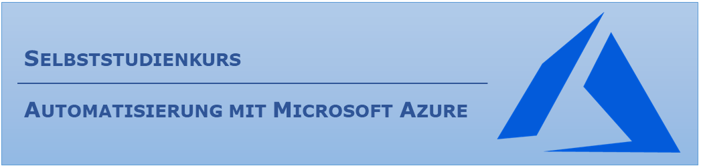

# **Automatisierung mit MS Azure** 

### **Ihr Nutzen**

- Sie lernen die Microsoft Azure Plattform kennen
- Sie wissen wie man automatisiert einen Windows Server 2016 installiert
- Sie lernen die Programmierschnittstelle REST kennen und anwenden

### **Dauer**
- Etwa zwei Stunden

### **Zielgruppe**
Dieser Selbststudienkurs ist für komplette Neulinge im Bereich Azure und REST API ausgelegt.

### **Inhaltsverzeichnis**
Der Kurs wird aufgeteilt in vier Kapitel: 

- [00-Grundlagen](00-Grundlagen/)
- [01-Loginvorgang](01-Loginvorgang/)
- [02-VirtuelleMaschine](02-VirtuelleMaschine/)
- [03-Fragen](03-Fragen/)